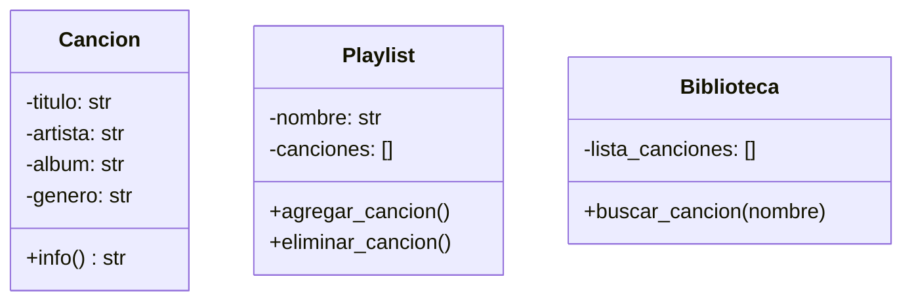

```mermaid
classDiagram

class Cancion {
    -titulo: str
    -artista: str
    -album: str
    -genero: str
    +info() str
}

class Playlist {
    -nombre: str
    -canciones: []
    +agregar_cancion()
    +eliminar_cancion()
}

class Biblioteca{
    -lista_canciones: []
    +buscar_cancion(nombre)
}
```
